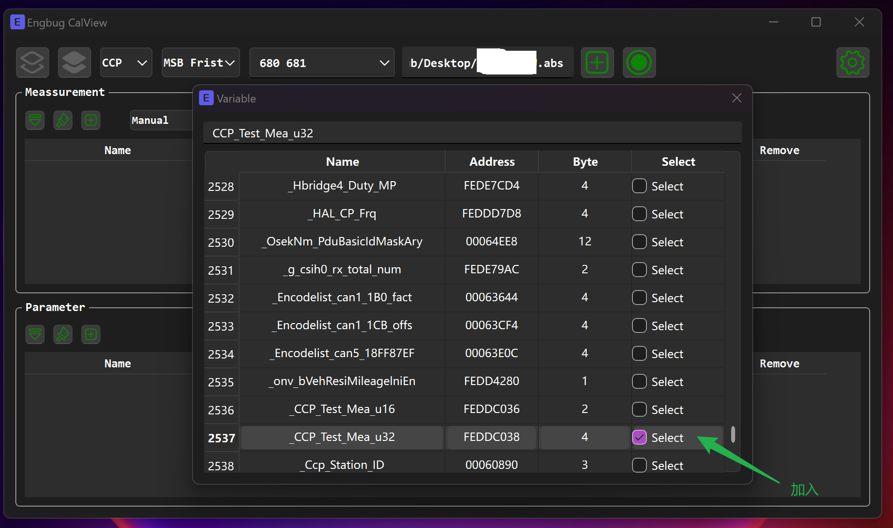
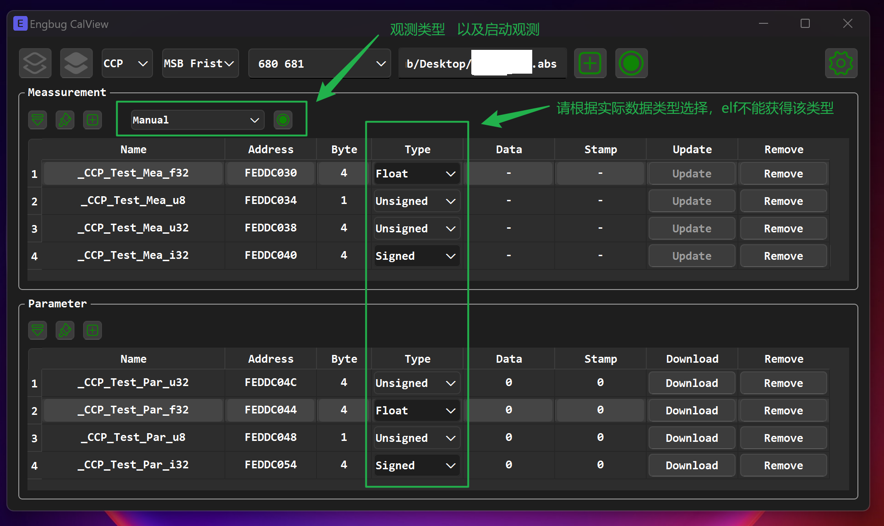

# Engbug

Engbug是一款支持CAN的CAN报文接收发送、诊断、标定功能的软件。功能持续开发中。

## 开发日志

### 2025.01.01
1. 支持UDS诊断功能。
2. 项目文件保存功能。
### 2024.06.30
1. 支持PeakCAN、VectorCAN。
2. 支持CAN报文发送接收、周期发送、字节自增发送、保存为asc记录文件。
3. 支持CCP标定和观测，不需要a2l进行标定和观测（需要elf格式文件）。
5. 日志显示支持设置ID报文转为字符串（多帧）。

## 计划中功能
1. 支持更多CAN设备。
2. 增加报文接收支持字节折线图显示，或BDC做数据分析。
3. 增加标定观测折线图显示，支持数据分析； 增加DQA观测。
4. 增加UDS固件下载功能。
5. ......

## 设备连接

运行Engbug后，选择参数后连接硬件设备以通信。可以选择Vector虚拟通道，支持4路独立连接的通道。
Vector时间戳是连接时触发开始计时，因此多个通道独立连接会导致不同通道的起始时间不同步。
Peak不支持发送返回帧数据和时间戳。因此只有接收帧数据和时间戳。
基于以上原因，本软件做了软件时钟。精确度不如从驱动层拿取的时间戳。
建议：
1. 单通道使用VectorCAN时使用硬件时间戳。
2. 多通道使用时或者单通道使用PeakCAN时使用软件时间戳。

## 功能托盘

本程序是一个托盘程序，关闭单个功能模块窗口时，程序不退出。在电脑右下角托盘中右键Engbug图标来选择功能窗口。退出同理。

## 日志窗口

日志窗口主要显示相关关键操作打印，可用于排错等。该窗口支持将特定ID转为字符串显示在日志窗口，支持多帧，如下方法设置

## 报文窗口
报文支持显示总线上的帧数据。
1. 支持单帧、折叠显示
2. 支持ID过滤，过滤器可通过、阻止、以及过滤器无效，默认过滤器无效。
3. 支持将报文保存为asc格式，方便其他工具来分析。
4. 发送支持手动、周期发送；暂时最小周期支持10ms发送，更小周期后续支持。
5. 支持在报文数据某个字节自增发送，可用于分析丢帧。
6. 支持错误帧显示

## 标定窗口
该功能需要被标定设备支持CCP协议。XCP后续支持。
暂时只支持轮询模式观测数据，DAQ模式后续支持。

添加变量前请确保选择了elf文件。

elf文件中无变量类型信息。添加好了变量后确保选择正确的数据类型Unsigned、Signed、Float，正确的数据类型才能正确显示数据。

参数模块Data输入后需要点击Download才能发送给控制器。

## 诊断窗口

诊断窗口支持Run/Check两种流程，使用上方增加和切换工具建立流程。可单独执行流程或者全部流程。

Run：表示要执行计算、发送帧等操作。
Check：表示要检测回复的帧数据是否有效、或保存帧数据中的部分数据为变量。

例如第一条发送10 03数据，第二条表示检测收到的帧是否是50 03，并保存3、4两个字节存储到变量Time中。

## 安装说明

安装密码：fzxhub

